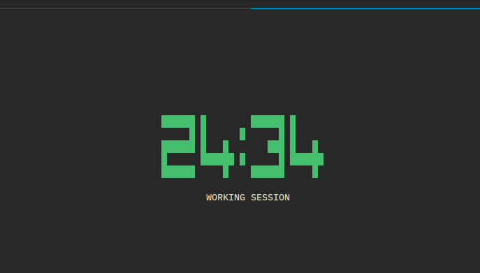

# tomato

`tomato` is a fork of [`gone`](https://github.com/guillaumebreton/gone) "a simple cli
pomodoro timer for OSX and Linux",
but rebuilt with [bubbletea](https://github.com/charmbracelet/bubbletea)



# Installation

See the [release page](https://github.com/faustind/tomato/releases) to get the 
right artifact and put it in your path :)

# Usage

Run `tomato` and use `q` or `ctrl+c` to quit.

```
$ ./bin/tomato -h
Usage of ./bin/tomato:
  -l int
        Duration of a long break (default 10)
  -p string
        Pattern of a working session (default "wswswl")
  -s int
        Duration of a short break (default 5)
  -w int
        Duration of a working session (default 25)
```

